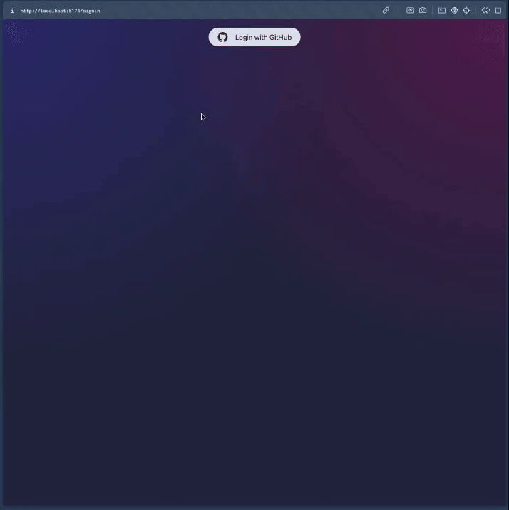

# Capstone_Project
Emotion Classifier and RAG app implementation on diary entries of different users: 

Using the Frontend, users can add a journal entry.
The entry is processed by the backend to send an appropriate chat response to the user.
In parallel, the Emotion Classification Model classifies the emotions and saves the results in the database for further access in the form of a mood tracking dashboard.

## Classification Model
The machine learning process for building the emotion classifier is described in the accompanying google colab notebook. The model can be used for inference directly from [Hugging Face](https://huggingface.co/Dimi-G/roberta-base-emotion).

## Complete application
You can view the complete application under the folder *Daily Stand Up : The Journal App*
